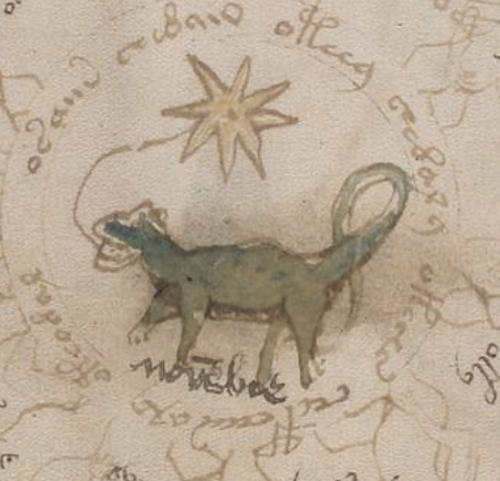

# Voynich Manuscript Computational Analysis
<div style="text-align: center;">


**"RAWR!"** --*Scorpio, ca. 1430*
</div>

A distributional-semantic and structural analysis of the Voynich manuscript text, with systematic cross-referencing between the transcribed text and the illustrated content.

**See [reports/PROGRESS.md](reports/PROGRESS.md) for the comprehensive findings with evidence ratings.**

## What this is

This repository contains scripts, data, and reports from a multi-session investigation into the Voynich manuscript (Beinecke MS 408), treating it as a natural language encoded in a novel script. We make **no phonetic assignments** and do not claim to have deciphered the manuscript. What we have established:

- The **writing system** has ~20 functional units; EVA 'c' is structural; gallows characters are modifiers
- The **morphological system** is real and productive — declension agreement 1.7-2.0× above chance, vector analogies work (ol:or::al:ar → ar at 0.72 cosine)
- The **text describes the illustrations** — each section has exclusive vocabulary matching its visual content
- A **label cross-reference network** links specific labeled objects across the four "applied" sections (Herbal → Zodiac → Bio/Bath → Pharma). The `otaly` label was visually confirmed as the same brown multi-fingered root on two different pharma pages (f88r, f99v)
- A **preliminary lexicon** of ~40 entries with graded evidence (A/B/C confidence)

## Directory structure

```
├── scripts/                     # Python analysis code
│   ├── 01_parsing/             # Transcript parser, tokenizer
│   ├── 02_morphology/          # Glyph, declension, paradigm analysis
│   ├── 03_semantics/           # Vectors, cross-refs, label network
│   ├── 04_content/             # Plants, colors, hapax, astro, lexicon
│   ├── 05_pipeline/            # Apple Vision folio segmentation
│   └── paths.py                # Centralized path helper
├── data/
│   ├── transcription/          # Input: transcript + parsed NLP JSON
│   ├── analysis/               # Per-analysis JSON outputs
│   ├── lexicon/                # Lexicon, label network, figure DB
│   └── visual/                 # Vision pipeline metadata
├── reports/
│   ├── PROGRESS.md             # Full findings report
│   ├── html/                   # HTML reports with Voynich glyphs
│   ├── text/                   # Text reports (label network map)
│   └── visual_notes/           # Manual visual verification notes
├── fonts/                      # VoynichEVA font + mappings (Kreative Software)
└── .venv/                      # Python environment (gitignored)
```

Large image outputs (`folios/`, `crops/`, `annotated/`) and the source PDF (`source/`) are **gitignored** due to size. You'll need to regenerate them locally (see below).

## Setup

```bash
python3 -m venv .venv
source .venv/bin/activate
pip install numpy scipy Pillow pyobjc-framework-Vision pyobjc-framework-Quartz
```

You'll also need:
- `poppler` for PDF extraction: `brew install poppler`
- A copy of the Yale Beinecke [MS 408 high-res scan](https://collections.library.yale.edu/pdfs/2002046.pdf) saved as `source/voynich_scan_yale.pdf`
  (or adjust `scripts/05_pipeline/segment_pipeline.py`)

## Pipeline

Scripts are ordered by phase. Run from the project root so the `data/` paths resolve:

1. **Parsing** — `scripts/01_parsing/voynich_parser.py` reads the IVTFF transcript, builds consensus lines across transcribers, and writes `data/transcription/voynich_nlp.json`. Then `tokenizer.py` produces the bias-free structural tokenization.

2. **Morphology** — `glyph_reanalysis.py` tests alphabet decomposition hypotheses. `declension_analysis.py` finds paradigm stems. `declension_tables.py` generates the HTML paradigm tables.

3. **Semantics** — `vectors.py` builds PPMI+SVD word vectors (1,478 words × 50 dims). `visual_crossref.py` correlates vocabulary with illustration type. `label_network.py` builds the complete cross-reference map.

4. **Content** — specific analyses: `plant_features.py`, `color_crossref.py`, `astro_alignment.py`, `hapax_analysis.py`, `seven_planets.py`, `ottoman_hypothesis.py`. `lexicon.py` consolidates findings into the preliminary lexicon.

5. **Visual pipeline** — `segment_pipeline.py` extracts folio images from the PDF and runs Apple Vision (saliency, text detection, rectangles). `extract_objects.py` crops detected objects and matches them to labels.

## Source data

- **Transcript**: IVTFF interlinear v1.5 (Stolfi release 1.6e6, Dec 1998). Consensus built from Takahashi (H), Currier (C), Friedman/FSG (F), Landini (N), Stolfi (U), Grove (V).
- **Figure annotations**: compiled from [voynich.nu](https://www.voynich.nu/) quire-by-quire descriptions.
- **Font**: VoynichEVA PUA font by Rebecca Bettencourt / Kreative Software (OFL license).
- **Images**: Yale Beinecke Rare Book & Manuscript Library, MS 408 (not included in repo).

## What this analysis cannot do

1. Assign phonetic values to any character
2. Translate any sentence
3. Determine the underlying language
4. Decode the manuscript if it is in fact enciphered

Everything here is **structural and distributional**. The findings are what they are because the numbers support them, not because we've solved the script.

## License

Analysis code: released to the public domain. Use it as you like.
Font: see [fonts/Fairfax/OFL.txt](fonts/Fairfax/OFL.txt) for font license.
Transcript: see the header of `data/transcription/transcript.txt` for origin and terms.
